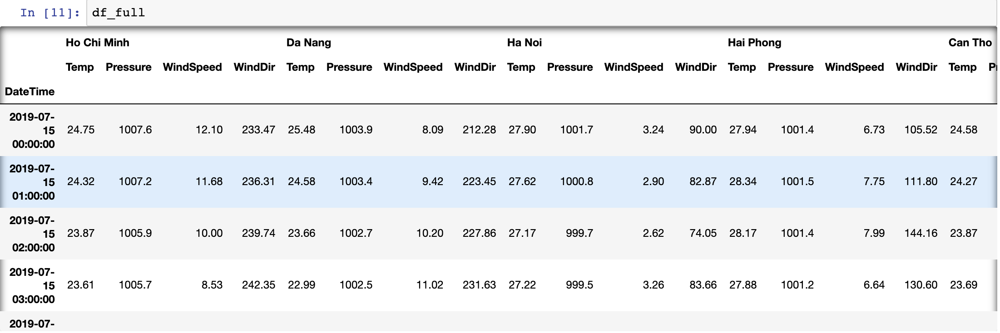
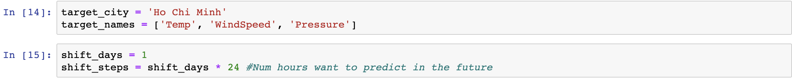
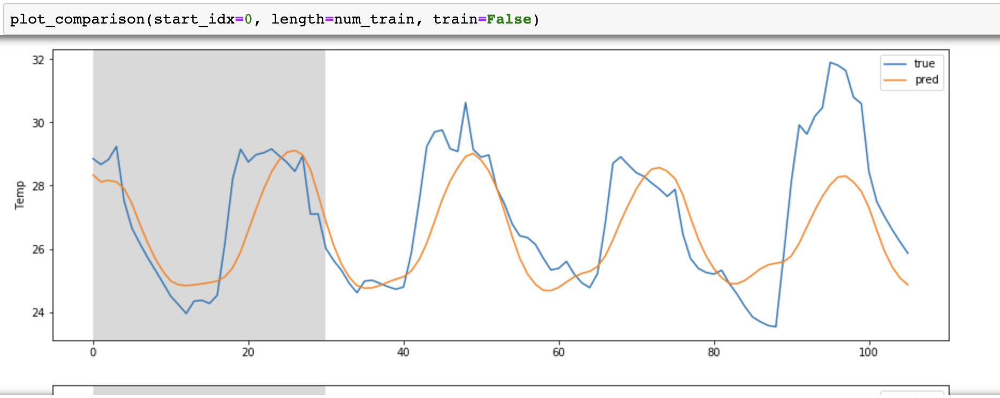
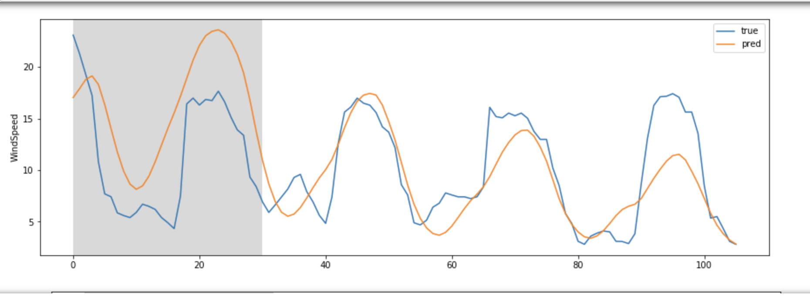
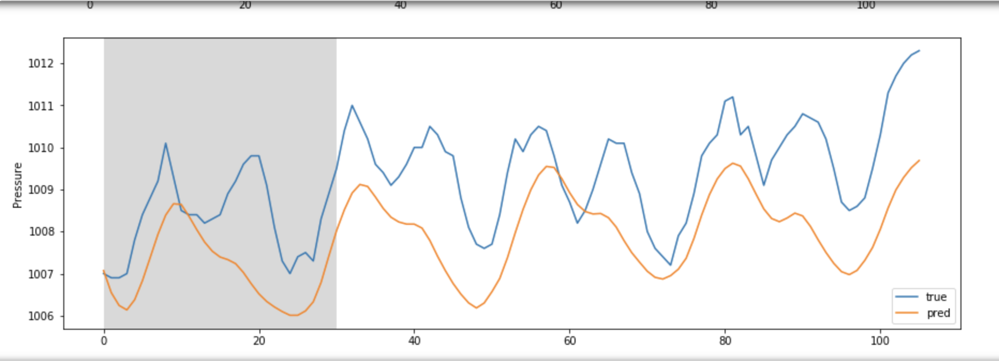
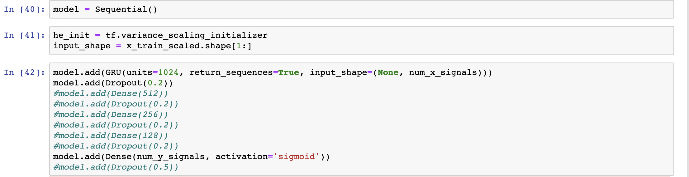

# WeatherForecast

RNN-based model for weather prediction in cities using GRU network and crowd-sourced data

## Getting Started

Get weather data from your chosen city as well as four other nearby cities, in my case I chose Ho Chi Minh city, Hanoi, Danang, Haiphong, and Can tho. Then, parse the data into the correct format to be read as inputs (Parse function in hochiminh weather.ipynb). Use meteoblue.com for free weather report of 2 week periods.



### Prerequisites

```
matplotlib.pyplot
tensorflow
numpy
pandas
os
MinMaxScaler from sklearn
Keras
```

## Running the tests

Change the name of the target_city variable to the city you want to forecast. Then change the shift_days to the number of days that you want predict the weather by.



### To see how accurate the model is, run the code to see comparisons between training and test files.





## Additional

You can play around with the model by changing the initializer, activation function, adding more layers, etc...



## Authors

* **DucMinh Ngo** - *Initial work* - [PurpleBooth](https://github.com/dmngo1999)


## Acknowledgments

* Based heavily on Hvass-Labs TensorFlow Tutorials

